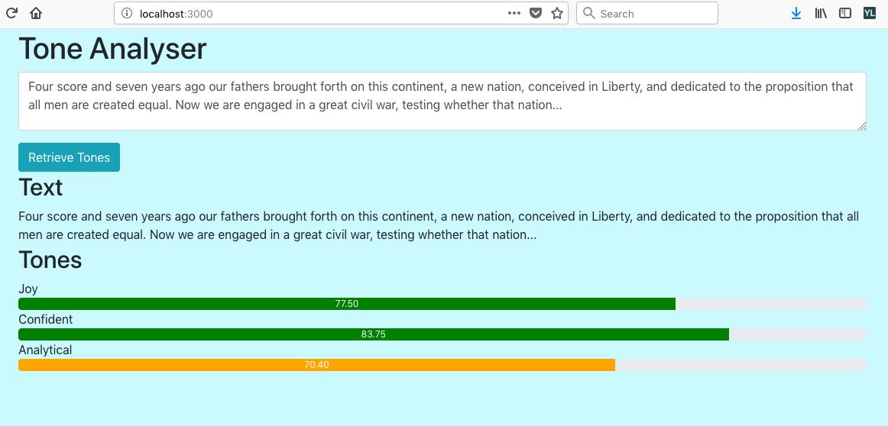

# Express React App



## Create Express Backend API
### 1. Create Basic Express API
Begin by creating the `express_react_app` root folder and inside this folder create `server.js`.<br />
If you use Git, create a `.gitignore` file from [Official Gitignore for Node](https://github.com/github/gitignore/blob/master/Node.gitignore) to ignore uploading files such as `node_modules` to Git.<br />
Create `package.json` and accept all default values using enter key, then finally select `yes`:
```
npm init
```
Install `Express` as our web application framework:
```
npm install --save express
```
Inside `server.js` let\'s create a basic API:
```
const express = require('express');
const app = express();
const port = process.env.PORT || 5001;

// create a GET route
app.get('/api', (req, res) => {
  res.send({ express: 'EXAMPLE API DATA' });
});

// log your server is running and the port
app.listen(port, () => console.log(`Listening on port ${port}`));
```
In terminal, start your server:
```
npm start
```
In a browser direct to [http://localhost:5001/api](http://localhost:5001/api) to view your basic API.<br />

### 2. Call Watson Tone Analyzer From Express
Create a Watson Tone Analyzer service on the [IBM Cloud](https://www.ibm.com/cloud/).<br />
Create a `.env` environments file to store your Watson Tone Analyzer service credentials:
```
IAM_API_KEY=<ENTER_YOUR_API_KEY_HERE>
IAM_API_URL=<ENTER_YOUR_API_URL_HERE>
```
Install `dotenv` to facilitate loading environment variables from our `.env` file into `process.env`:
```
npm install --save dotenv
```
At the top of `server.js` require and configure `dotenv`:
```
require('dotenv').config();
```
Install `watson-developer-cloud` SDK to facilitate communication with Watson APIs. We will specifically call Watson Tone Analyzer:
```
npm install --save watson-developer-cloud
```
Update `server.js` to require and configure [Tone Analyzer](https://cloud.ibm.com/docs/services/tone-analyzer?topic=tone-analyzer-gettingStarted#gettingStarted) directly after the port number has been set:
```
const ToneAnalyzerV3 = require('watson-developer-cloud/tone-analyzer/v3');
const toneAnalyzer = new ToneAnalyzerV3({
  version: '2017-09-21',
  iam_apikey: process.env.IAM_API_KEY,
  url: process.env.IAM_API_URL
});
```
Add the following below the Tone Analyzer require and configure, so that Express can parse the JSON response from the Watson service:
```
app.use(express.json());
```
Update the GET route to listen to `/tone` and use the async/await feature of ES8 to send the request to the Watson service and a try/catch to handle any response errors:
```
// create a GET route
app.get('/tone', async (req, res) => {
  let parameters = {
    tone_input: { 'text': req.query.text },
    content_type: 'application/json'
  };

  try {
    const toneAnalysis = await toneAnalyzer.tone(parameters);
    res.send(toneAnalysis);
  } catch (error) {
    console.log(error);
    res.status(error.code).send(error);
  }
});
```
Re-start the server and direct to [http://localhost:5001/tone?text=The%20food%20tasted%20very%20distgusting](http://localhost:5001/tone?text=The%20food%20tasted%20very%20distgusting) to see the tones: score, tone_id and tone_name.<br />
<br />

## Create React Frontend
### 1. Update Express Backend API to Integrate with React Frontend
Install `cors` to facilitate Cross-Origin Resource Sharing, allowing the frontend to talk to the backend via HTTP:
```
npm install --save cors
```
In `server.js` require and use the `cors` middleware by adding the code below the Tone Analyzer configure:
```
const cors = require('cors');

app.use(cors());
```
Our Express API server is ready complete. Leave the server running and open a second terminal window.

### 2. Create React Frontend
Create a `client` folder by using the React starter, with command:
```
npx create-react-app client
```
Change into the client folder directory and add Bootstrap for popular front-end components:
```
npm install --save bootstrap
```
Include the import for bootstrap in `src/index.js`:
```
import 'bootstrap/dist/css/bootstrap.css';
```
Add a proxy to the client `package.json` (directly above `"eslintConfig": {`) so that Webpack will proxy our API requests to our Express backend:
```
"proxy": "http://localhost:5001/",
```
Run the client and see the React starter:
```
npm start
```

### 3. Update Components in the React Frontend
Start by removing all references to the logo by deleting in `App.js`:
```
import logo from './logo.svg';


```
Then delete the `logo.svg` file.<br />
Now we will refactor the `App.js` class by deleting:
```
export default App;
```
We can see this is a breaking change to the app as now `Index.js` cannot import `App.js`. So we must update `class App extends Component {` to:
```
export default class App extends Component {
```
Replace the existing render function in `App.js` with:
```
render() {
 return (
   <div className="container">
     <h1>Tone Analyser</h1>
     <div>
       <div className="form-group">
         <textarea className="form-control" id="text-input" placeholder="Enter text here" onChange={e=>this.updateText(e)}></textarea>
       </div>
       <button className="btn btn-info" onClick={() => this.getTones()}>Retrieve Tones</button>
     </div>
   </div>
 );
}
```
Try typing into the text field and you will get a breaking error. We need to add a function that will be called when the text is updated.
Add the following function inside the App class above render method:
```
updateText(e) {
 this.setState({
   text: e.target.value
 });
}
```
Note: The render function is always the bottom function in a class.

### 4. Add a New Nested Component to the React Frontend
Create a new component file called `Result.js` in the `client/src` folder.
Add the following to `Result.js`:
```
import React, { Component } from 'react';

export default class Result extends Component {

  render() {
    return (
    <div className='form-block'>
      <div className="row">
        <div className="col">
          <h2>Text</h2>
        </div>
      </div>
      <div className="row">
        <div className="col">
          text_placeholder
        </div>
      </div>
      <div className="row">
        <div className="col">
          <h2>Tones</h2>
        </div>
      </div>
      <div className="row">
        <div className="col">
          tones_placeholder
        </div>
      </div>
    </div>
  );
  }
}
```
You will not see any updates on the frontend yet. <br />
In `App.js` we need to import `Result.js`:
```
import Result from './Result';
```
Then add it to the render method of the App component:
```
  ...
    <button className="btn btn-info" onClick={() => this.getTones()}>Retrieve Tones</button>
  </div>
  <Result/>
</div>
```
You will now see the update in the frontend.<br />
In `App.js` we will add a constructor to the top of the class and initialize 2 state variables - text and tones:
```
constructor() {
  super();

  this.state = {
    text: 'Four score and seven years ago our fathers brought forth on this continent, a new nation, conceived in Liberty, and dedicated to the proposition that all men are created equal. Now we are engaged in a great civil war, testing whether that nation...',
    tones: []
  };
}
```
Note: Constructors must always be at the top of the class.
Now we will send data from through the component hierarchy from `App.js` to `Result.js` in the form of props.
We update `<Result/>` component in `App.js` to:
```
<Result text={this.state.text} />
```
In `Result.js` update `text_placeholder` to:
```
{this.props.text}
```
Notice the initialized text is now being rendered by the Result component and when you type in the text field it is replicated.<br />

Finally upon page load, we want to initialize the text-field to equal the value of text stored in the state. Understanding the life-cycle of React, we need to use the `componentDidMount()` to ensure rendering happens after the constructor has been set. We will also update the background color to a light blue and we will call `getTones()` so that when the page initially loads we will do a RESTful call to the backend to get the values from the Watson Tone Analyzer API:
```
componentDidMount() {
  document.body.style.background = '#cafafe';
  document.getElementById('text-input').value = this.state.text;
  this.getTones();
}
```

### 5. React Frontend Calls the RESTful Backend
Upon page load or when we click the `Retrieve Tones` button, we realize that nothing happens. The `componentDidMount()` and the button with an `onClick()` action both call `getTones()` and we haven't yet defined this function in our code yet. Let's do that now in `App.js` below `updateText()`:
```
async getTones() {
  try {
    const response = await fetch(`${this.baseUri}/tone?text=${this.state.text}`);
    const toneResponse = await response.json();

    this.setState({
      tones: toneResponse.document_tone.tones
    });
  } catch (error) {
    this.setState({
      tones: []
    });
  }
}
```
This is an Async function, a new feature added as part of ES8. We will add the following line to define the baseURI at the top of the component above the constructor:
```
baseUri = 'http://localhost:5001';
```
If we inspect the page and use the `React Developer Tool Add-On` we can see that when we have text in the text-field such as the example `Gettysburg Address` text, then upon clicking the button we do indeed do a RESTful call and store values into an array called `tones` in the state of the App component.<br />
To render the tone information to the page we will need to pass it via props to the nested component, `Result.js` by updating the component in the `App.js` render method to:
```
<Result text={this.state.text} tones={this.state.tones}/>
```

### 6. Render A Map Of Components
In `Result.js`, we will update the `tone_placeholder` to the following function call:
```
{this.renderResults()}
```
When we make the RESTful API call to the backend, there could be zero to many tones returned. This means we will need to render zero to many tone records. If the there is at least one tone we will create a list item showing the tone name and score. Also notice that each component generated from an array requires a unique key so that React can trace if the component has been updated and the individual component needs to be updated rather than updating all components of this type:
```
renderResults() {
  if (this.props.tones.length === 0) {
    return 'No tones detected';
  }
  return this.props.tones.map(classification => {
    const key = classification.tone_id;
    return <li key={key}>Tone Name: {classification.tone_name}, Score: {classification.score}</li>;
  });
}
```

### 7. Another Nested Component
Create a new file `Record.js` that will be the component responsible for rendering each tone found in the text. In this file set the state using the props passed in from the parent component and round the score to 2 decimal places:
```
import React, { Component } from 'react';

export default class Record extends Component {
  constructor(props) {
    super(props);
    this.state = {
      tone: props.classification.tone_name,
      score: (props.classification.score * 100).toFixed(2)
    };
  }

  render() {
    return (
      <div className="row">
        <div className="col">
          {this.state.tone}: {this.state.score}   
        </div>
      </div>
    );
  }
}
```
Update `Result.js` to import the Record component by adding the following line below the import React line of code:
```
import Record from './Record';
```
Then we will update the `renderResults()` in `Results.js` to use the Record component. Replace:
```
return <li key={key}>Tone Name: {classification.tone_name}, Score: {classification.score}</li>;
```
with
```
return <Record classification={classification} key={key}/>;
```

### 8. Add Bootstrap Progress Bars 
In `Record.js` we want to add a progress bar for each tone based on the score. Replace:
```
{this.state.tone}: {this.state.score}  
```
with
```
{this.state.tone}
<div className="progress">
  <div className="progress-bar" style={{width: `${this.state.score}%`, backgroundColor: this.getColor(this.state.score)}}>{this.state.score}</div>
</div> 
```
Notice above we call `getColor()` to set the background colour of the progress bar. We will add the function `getColor()` below our constructor in `Record.js`:
```
getColor(score) {
  if (score > 75) {
    return 'green';
  } else if(score > 50){
    return 'orange';
  } else {
    return 'red';
  }
}
```

### 9. Binding In Constructor
In `App.js` we will update our binding to be done in the constructor rather than binding using arrow functions for improved performance.<br />
Update the constructor to bind the `getTones` and `updateText` methods in the constructor:
```
constructor() {
  super();

  this.state = {
    text: 'Four score and seven years ago our fathers brought forth on this continent, a new nation, conceived in Liberty, and dedicated to the proposition that all men are created equal. Now we are engaged in a great civil war, testing whether that nation...',
    tones: []
  };

  this.getTones = this.getTones.bind(this);
  this.updateText = this.updateText.bind(this);
}
```
In the `textarea` update the onChange function to call the `updateText` method:
```
onChange={this.updateText}
```
In the `button` update the onClick function to call the `getTones` method:
```
onClick={this.getTones}
```

We have created a simple React frontend application that uses a RESTful GET request to communicate with our Express backend application that communicates with IBM's Watson Tone Analyzer service to give a dynamic and responsive single-page web application.